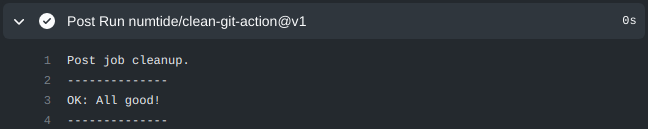
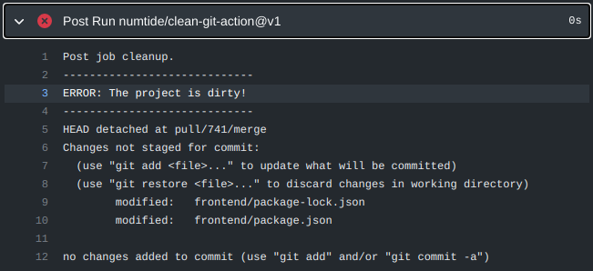

# Clean Git Status Action - leave no build artifacts behind.

A very small GitHub Action that checks that the `git status` is clean at the
end of a build.

Build process tends to drift and leave files behind that are either changed or
untracked. Generally when that happens, it can be either of those two things:

1. A new build artifact appeared, that should be added to `.gitignore`
2. Some `.lock` file or other generated file was updated and needs to be
   committed to the repo.

By adding this simple action to your project, you make sure that these issues
are surfaced early.

## Usage

Add the following step to your action YAML

```yaml:
- uses: numtide/clean-git-action@v1
```

Here is how it looks like on success:



Here is how it looks like on failure:



That's it!

## License

MIT - 2021 Numtide
